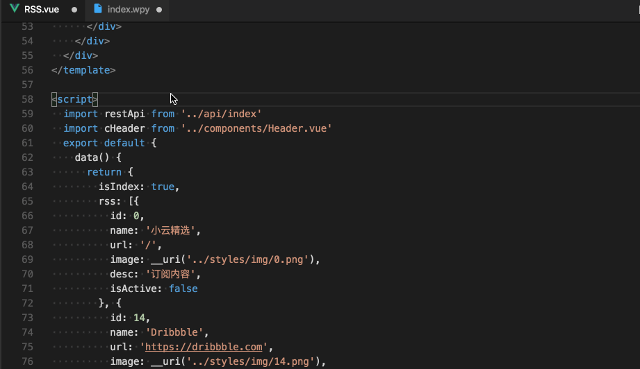

# wepy-beautify for vscode

## Features

Beautify Vue or wpy code in Visual Studio Code.



## Usage

1. Keyboard Shortcut: `ctrl+shift+6` ;
2. Open context menu in wpy, choose `Beautify wpy` ;
3. Press `F1`, search `Beautify wpy`, and click the item.

## Indent Option

The wpy-beautify's indent option according to the textEditor's indent option, like this: 


## Keyboard Shortcut

Use the following to embed a beautify shortcut in keybindings.json. Replace with your preferred key bindings.

```json
    {
      "key": "ctrl+shift+6",          
      "command": "extension.wpyBeautify",
      "when": "editorTextFocus && !editorReadonly" 
    }
```
## ps
最近做小程序开发，使用到了wepy框架。wpy的文件都是用vue的高亮规则，配置[首选项]-[设置]:
```json
"files.associations": {
        "*.vue": "vue",
        "*.wpy": "vue",
        "*.wxml": "html",
        "*.wxss": "css"
    },
    "emmet.syntaxProfiles": {
        "vue-html": "html",
        "vue": "html"
    },
```
但是，没有好的格式化工具。wepy官网推荐修改后缀为.vue。并使用vue-beautify来格式化。本人还是希望使用wpy后缀，所以就在vue-beautify基础上优化了配置。并解决了vue-beautify格式化后有大量空行的问题。wpy-beautify有如下功能(在mac上验证ok)：
1. 支持.vue和.wpy文件格式化 ;
2. 使用快捷键`shift+cmd+6`格式化 ;
3. 可以使用`shift+cmd+p`调出命令窗口，然后输入`wpy`，按`回车`生效。
4. 可以在当前文件窗口，鼠标右击菜单中选择`beautify wpy`。
5. 本插件未上传vscode的官网。可以手动安装目录下`.vsix`文件。（扩展管理器-》从VSIX安装，然后重启vscode）
6. vscode插件开发方法网上有很多栗子。如：https://segmentfault.com/a/1190000008968904#articleHeader3
7. gif动画工具，mac上使用的是`LICEcap for mac`。
8. 版本号与参考时vue-beautify的一致。


## Github
[https://github.com/webdzq/plugins/wpy-beautify](https://github.com/webdzq/plugins/wpy-beautify)

## 参考工具：

[https://github.com/peakchen90/vue-beautify](https://github.com/peakchen90/vue-beautify)